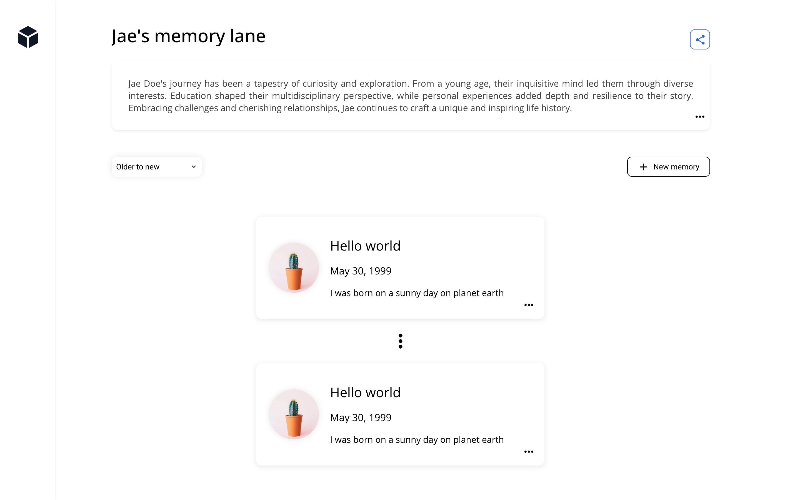

# Mary's Memory Lane

## Technical Decisions

- **MUI (Material UI)**: I used MUI for the components because it offers a rich set of components, which I have used in the past and find effective.
- **Emotion**: Used for CSS as MUI supports and leverages this styling solution.
- **react-dropzone**: Implemented for creating the image upload feature with drag-and-drop functionality.
- **Redux**: Utilized to manage the state within the application.
- **Custom Hook**: Created to connect the components with the service.
- **Image Handling**: Images are read and sent to the backend in File buffer format for storage in the memories table. 
- **API**: Images are encoded in base64 format before sending the response to GET requests. While base64 encoding is used here, it is generally better to use cloud storage solutions such as S3 to store images due to the increased size of base64-encoded images.
- **Image Name Column**: Added to be used as a label in the update/create modal, providing feedback about the uploaded file.

## What Was Implemented

- A section for the page title.
- An About section.

- The "+ New Memory" button opens a modal for users to upload a new memory. 
  - The modal includes fields for title, description, date, and a box to upload a picture.

  

  - Handles user error messages for missing fields or excessively long titles.

  

- Users can see the memory on the page after submission.

- A carousel displays three memories at a time, with navigation arrows to view more cards.
  - The default order of cards is from newest to oldest, with an option to switch to "Older to New."

  

- Users can delete or update a memory via the "more" vertical icon.

  - A confirmation modal appears for deletion.

  

- There is a 'Share' button that, when clicked, copies the URL to the clipboard and displays a confirmation alert

## What Is Pending and Did Not Have Time to Implement

- User creation and sign-in forms.
- Application routing configuration.
- A table in the dataset for storing user information (username, password, and a brief personal text for the about section).
  - Create a one-to-many relationship between users and memories.
- Update the API to handle routes with the user ID.
- Update the frontend to display the user’s name and About section for specific users.
- Error handling and input validation in the backend.
- Use of environment variables.

## Challenges

- **Material UI and Styled-Components Bug**: There is a known bug with Material UI and styled-components, detailed in [this open issue](https://github.com/mui/material-ui/issues/32727). This issue may occur when running the application in development mode. Since the problem was detected late, no alternative solutions or styling approaches were implemented.
  - **Workaround**: Follow the instructions below if you encounter the issue.

## Instructions

- **Node Version**: v22.2.0

### Bug Workaround

If you experience the following error while running in dev mode:

1. Remove the `node_modules` folder and reinstall dependencies.
2. Alternatively, compile and review the application using the `vite preview` command.

# Planned coding challenge: Memory lane

**Please avoid initiating pull requests on this repository or forking this repository. To submit your solution, either set up a repository on your own account or forward a zip file to the appropriate contact within our talent team.**

### Problem definition

After a series of discovery calls we found out a problem that our users are facing. They are having a hard time sharing their memories with friends and family. They are using a combination of social media, messaging apps, and email to share their memories. They are looking for a solution that allows them to store and share their memories in a single place.

As a first iteration for this solution, we want to build a web application that allows users to create a memory lane and share it with friends and family. A memory lane is a collection of events that happened in a chronological order. Each event consists of a title, a description, a timestamp, and at least one image.

## Deliverables

- Clone this repository and create a new branch with your name. Open a pull request on your own instance of the repository.
- An updated README providing a high level explanation of your implementation.
- **Screenshots or a short video/gif** showing your UI implementation.
- Update the API to accommodate for your technical design. Run the API by using `npm run serve:api`.
- The provided mockup is only for reference and inspiration. Feel free to improve it!

### FAQ

- **Can I add a framework like Next?** If you have the time, go for it, we want to see you use your favorite tools.
- **Is user authentication required?** No, it is not required.
- **Can I use a component library?** Yes, you can use a component library.
- **What will you be looking for?** Good user experience, reusable code, and a well thought out technical design.

### Inspiration mockup

